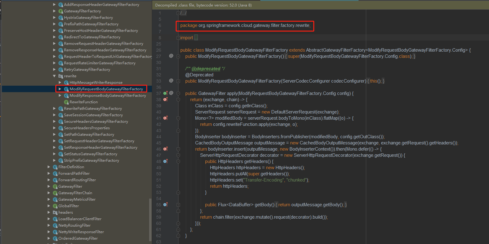

Spring Cloud Gateway 读取、修改请求体（解决request body内容被截断基于2.0.6版本，升级版本后可能不存在此问题）


 <!-- more -->


# Spring Cloud Gateway 读取、修改请求体（解决request body内容被截断）

本文涉及到的项目使用的版本如下：

Spring Boot：2.0.6.RELEASE

Spring Cloud：Finchley.SR2

## 背景：

微服务架构，在网关服务里拦截每个请求，进行日志信息记录与管理，发现当请求体过长时，只能获取到一部分body，查看拦截过滤器，发现Spring Cloud Gateway是基于reactor-core.jar进行请求数据的操作，获取body内容时，用到了reactor-core.jar的Flux<DataBuffer>，即一个包含0-N个DataBuffer类型元素的同步序列。

之前尝试了网上多种写法，不管是使用subscribe还是block，都**无效**

subscribe只会接收到第一个发出的元素，所以会导致获取不全，不管使用AtomicReference<String>还是StringBuilder来包装获取到的字符串，都无效。

翻看Spring Cloud Gateway包，会发现有个官方自带的修改请求体内容的过滤器工厂类：ModifyRequestBodyGatewayFilterFactory（对应的还有修改输出的body的过滤器工厂类）



 

 

 但是因为要结合我们自己的业务逻辑，所以这个类我们无法直接使用，但是可以自己定义一个类似的过滤器。

 

正确写法：


```
package cn.miao.gateway.filter;

import lombok.extern.slf4j.Slf4j;
import org.springframework.cloud.gateway.filter.GatewayFilter;
import org.springframework.cloud.gateway.filter.GatewayFilterChain;
import org.springframework.cloud.gateway.support.BodyInserterContext;
import org.springframework.cloud.gateway.support.CachedBodyOutputMessage;
import org.springframework.cloud.gateway.support.DefaultServerRequest;
import org.springframework.core.Ordered;
import org.springframework.core.io.buffer.DataBuffer;
import org.springframework.http.HttpHeaders;
import org.springframework.http.HttpMethod;
import org.springframework.http.MediaType;
import org.springframework.http.server.reactive.ServerHttpRequest;
import org.springframework.http.server.reactive.ServerHttpRequestDecorator;
import org.springframework.stereotype.Component;
import org.springframework.web.reactive.function.BodyInserter;
import org.springframework.web.reactive.function.BodyInserters;
import org.springframework.web.reactive.function.server.ServerRequest;
import org.springframework.web.server.ServerWebExchange;
import reactor.core.publisher.Flux;
import reactor.core.publisher.Mono;

@Slf4j
@Component
public class RequestBodyOperationFilter implements GatewayFilter, Ordered {

    @Override
    public Mono<Void> filter(ServerWebExchange exchange, GatewayFilterChain chain) {
        ServerHttpRequest request = exchange.getRequest();
        if (request.getMethod() != HttpMethod.POST) {
            return chain.filter(exchange);
        }
        return operationExchange(exchange, chain);
    }

    private Mono<Void> operationExchange(ServerWebExchange exchange, GatewayFilterChain chain) {
        // mediaType
        MediaType mediaType = exchange.getRequest().getHeaders().getContentType();
        // read & modify body
        ServerRequest serverRequest = new DefaultServerRequest(exchange);
        Mono<String> modifiedBody = serverRequest.bodyToMono(String.class)
                .flatMap(body -> {
                    if (MediaType.APPLICATION_JSON.isCompatibleWith(mediaType)) {
                        // 对原先的body进行修改操作
                        String newBody = "{\"testName\":\"testValue\"}";
                        return Mono.just(newBody);
                    }
                    return Mono.empty();
                });
        BodyInserter bodyInserter = BodyInserters.fromPublisher(modifiedBody, String.class);
        HttpHeaders headers = new HttpHeaders();
        headers.putAll(exchange.getRequest().getHeaders());
        headers.remove(HttpHeaders.CONTENT_LENGTH);
        CachedBodyOutputMessage outputMessage = new CachedBodyOutputMessage(exchange, headers);
        return bodyInserter.insert(outputMessage, new BodyInserterContext())
                .then(Mono.defer(() -> {
                    ServerHttpRequestDecorator decorator = new ServerHttpRequestDecorator(
                            exchange.getRequest()) {
                        @Override
                        public HttpHeaders getHeaders() {
                            long contentLength = headers.getContentLength();
                            HttpHeaders httpHeaders = new HttpHeaders();
                            httpHeaders.putAll(super.getHeaders());
                            if (contentLength > 0) {
                                httpHeaders.setContentLength(contentLength);
                            } else {
                                httpHeaders.set(HttpHeaders.TRANSFER_ENCODING, "chunked");
                            }
                            return httpHeaders;
                        }

                        @Override
                        public Flux<DataBuffer> getBody() {
                            return outputMessage.getBody();
                        }
                    };
                    return chain.filter(exchange.mutate().request(decorator).build());
                }));
    }

    @Override
    public int getOrder() {
        return -1;
    }
}
```


原先body会被截断的写法A：


```
package cn.miao.gateway.filter;

import com.alibaba.fastjson.JSON;
import com.alibaba.fastjson.JSONObject;
import io.netty.buffer.ByteBufAllocator;
import lombok.extern.slf4j.Slf4j;
import org.springframework.beans.factory.annotation.Value;
import org.springframework.cloud.gateway.filter.GatewayFilter;
import org.springframework.cloud.gateway.filter.GatewayFilterChain;
import org.springframework.core.Ordered;
import org.springframework.core.io.buffer.DataBuffer;
import org.springframework.core.io.buffer.DataBufferUtils;
import org.springframework.core.io.buffer.NettyDataBufferFactory;
import org.springframework.http.HttpHeaders;
import org.springframework.http.HttpMethod;
import org.springframework.http.server.reactive.ServerHttpRequest;
import org.springframework.http.server.reactive.ServerHttpRequestDecorator;
import org.springframework.stereotype.Component;
import org.springframework.web.server.ServerWebExchange;
import reactor.core.publisher.Flux;
import reactor.core.publisher.Mono;

import java.nio.charset.Charset;

@Slf4j
@Component
public class RequestBodyOperationFilter implements GatewayFilter, Ordered {

    @Value("${unified.request.sign.flag}")
    private boolean signFlag;

    @Override
    public Mono<Void> filter(ServerWebExchange exchange, GatewayFilterChain chain) {
        ServerHttpRequest request = exchange.getRequest();
        // 只拦截POST 请求
        if (request.getMethod() != HttpMethod.POST) {
            return chain.filter(exchange);
        }
        // 操作body
        ServerHttpRequestDecorator serverHttpRequestDecorator = requestDecorator(exchange);
        return chain.filter(exchange.mutate().request(serverHttpRequestDecorator).build());
    }

    private ServerHttpRequestDecorator requestDecorator(ServerWebExchange exchange) {
        ServerHttpRequestDecorator serverHttpRequestDecorator = new ServerHttpRequestDecorator(exchange.getRequest()) {
            @Override
            public Flux<DataBuffer> getBody() {
                Flux<DataBuffer> body = super.getBody();
                return body.map(dataBuffer -> {
                    byte[] content = new byte[dataBuffer.readableByteCount()];
                    dataBuffer.read(content);
                    //释放掉内存
                    DataBufferUtils.release(dataBuffer);
                    //request body的json格式数据
                    String bodyJson = new String(content, Charset.forName("UTF-8"));
                    //转化成json对象
                    JSONObject jsonObject = JSON.parseObject(bodyJson);
                    // 对原先的body进行修改操作
                    jsonObject.put("testName", "testValue");

                    String result = jsonObject.toJSONString();
                    //转成字节
                    byte[] bytes = result.getBytes();
                    NettyDataBufferFactory nettyDataBufferFactory = new NettyDataBufferFactory(ByteBufAllocator.DEFAULT);
                    DataBuffer buffer = nettyDataBufferFactory.allocateBuffer(bytes.length);
                    buffer.write(bytes);
                    return buffer;
                });
            }

            //复写getHeaders方法
            @Override
            public HttpHeaders getHeaders() {
                HttpHeaders httpHeaders = new HttpHeaders();
                httpHeaders.putAll(super.getHeaders());
                //由于修改了请求体的body，导致content-length长度不确定，因此需要删除原先的content-length
                httpHeaders.remove(HttpHeaders.CONTENT_LENGTH);
                httpHeaders.set(HttpHeaders.TRANSFER_ENCODING, "chunked");
                return httpHeaders;
            }

        };
        return serverHttpRequestDecorator;
    }

    @Override
    public int getOrder() {
        return -1;
    }
}
```

原先body会被截断的写法B：


```
package cn.miao.gateway.filter;

import com.alibaba.fastjson.JSON;
import com.alibaba.fastjson.JSONObject;
import io.netty.buffer.ByteBufAllocator;
import lombok.extern.slf4j.Slf4j;
import org.springframework.cloud.gateway.filter.GatewayFilter;
import org.springframework.cloud.gateway.filter.GatewayFilterChain;
import org.springframework.core.Ordered;
import org.springframework.core.io.buffer.DataBuffer;
import org.springframework.core.io.buffer.DataBufferUtils;
import org.springframework.core.io.buffer.NettyDataBufferFactory;
import org.springframework.http.HttpMethod;
import org.springframework.http.server.reactive.ServerHttpRequest;
import org.springframework.http.server.reactive.ServerHttpRequestDecorator;
import org.springframework.stereotype.Component;
import org.springframework.web.server.ServerWebExchange;
import org.springframework.web.util.UriComponentsBuilder;
import reactor.core.publisher.Flux;
import reactor.core.publisher.Mono;

import java.net.URI;
import java.nio.charset.StandardCharsets;

@Slf4j
@Component
public class RequestBodyOperationFilter implements GatewayFilter, Ordered {

    @Override
    public Mono<Void> filter(ServerWebExchange exchange, GatewayFilterChain chain) {
        ServerHttpRequest request = exchange.getRequest();
        if (request.getMethod() != HttpMethod.POST) {
            return chain.filter(exchange);
        }
        ServerWebExchange serverWebExchange = requestExchange(exchange);
        return chain.filter(serverWebExchange);
    }

    private ServerWebExchange requestExchange(ServerWebExchange exchange) {
        ServerHttpRequest serverHttpRequest = exchange.getRequest();
        URI requestUri = serverHttpRequest.getURI();
        URI ex = UriComponentsBuilder.fromUri(requestUri).build(true).toUri();
        ServerHttpRequest newRequest = serverHttpRequest.mutate().uri(ex).build();

        // 获取body内容
        Flux<DataBuffer> body = serverHttpRequest.getBody();
        StringBuilder sb = new StringBuilder();
        body.subscribe(dataBuffer -> {
            byte[] bytes = new byte[dataBuffer.readableByteCount()];
            dataBuffer.read(bytes);
            DataBufferUtils.release(dataBuffer);
            String bodyString = new String(bytes, StandardCharsets.UTF_8);
            sb.append(bodyString);
        });

        String bodyStr = sb.toString();
        // 对原先的body进行修改操作
        JSONObject jsonObject = JSON.parseObject(bodyStr);
        jsonObject.put("testName", "testValue");
        String result = jsonObject.toJSONString();
        //转成字节
        byte[] bytes = result.getBytes(StandardCharsets.UTF_8);
        NettyDataBufferFactory nettyDataBufferFactory = new NettyDataBufferFactory(ByteBufAllocator.DEFAULT);
        DataBuffer bodyDataBuffer = nettyDataBufferFactory.allocateBuffer(bytes.length);
        bodyDataBuffer.write(bytes);

        Flux<DataBuffer> bodyFlux = Flux.just(bodyDataBuffer);
        newRequest = new ServerHttpRequestDecorator(newRequest) {
            @Override
            public Flux<DataBuffer> getBody() {
                return bodyFlux;
            }
        };
        return exchange.mutate().request(newRequest).build();
    }

    @Override
    public int getOrder() {
        return -1;
    }
}
```

